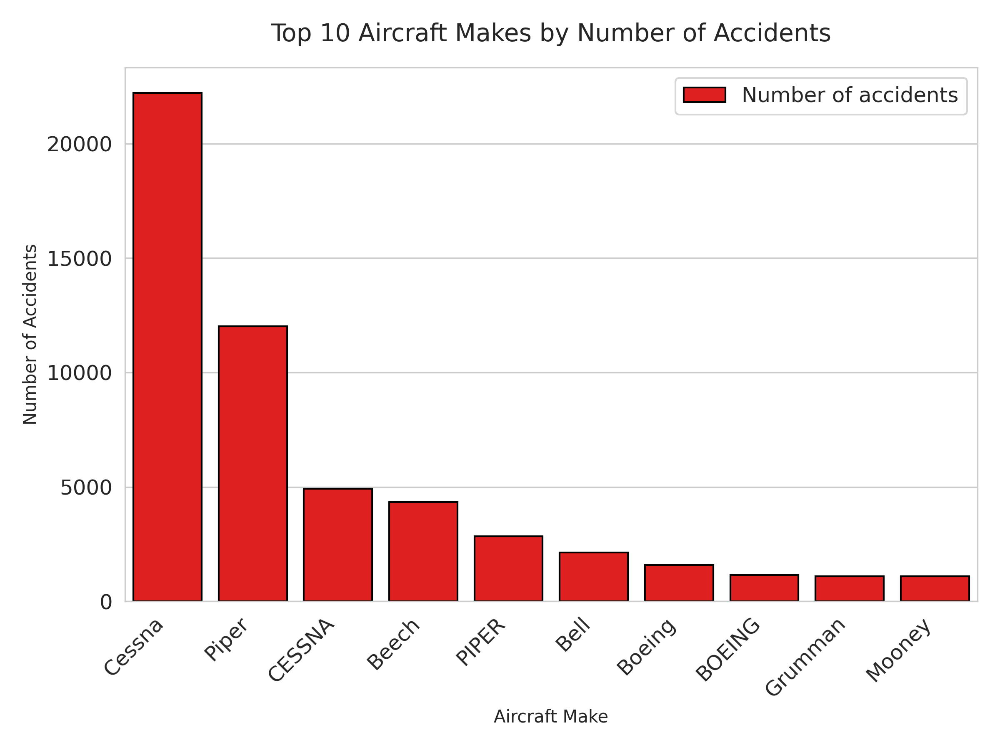
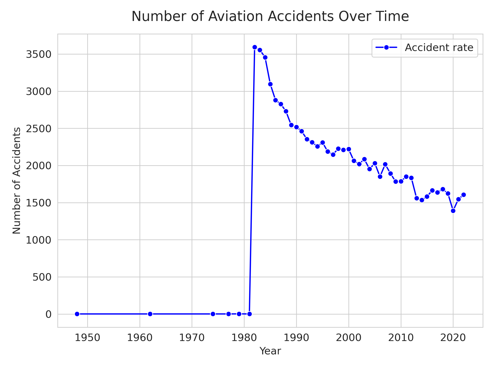
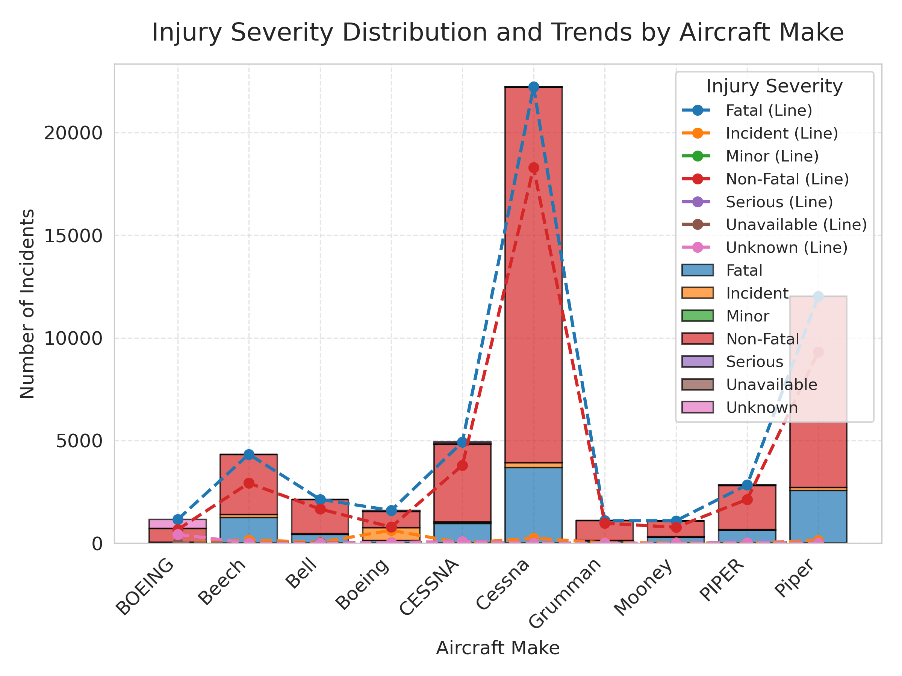
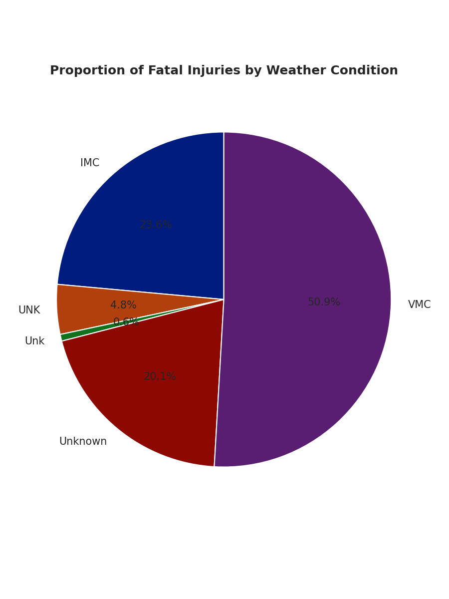

# Phase one project submission

-Studentname : Shallom Githui

-Instructor: Diana Mongina

## Goal
My project aims to find the lowest risk aircraft carriers and enhance aviation safety by understanding 
patterns in aviation accidents.

## Project overview
In this project using NTSB Aviation data(1962- 2023),(link to dataset: https://www.kaggle.com/datasets/khsamaha/aviation-accident-database-synopses), the aim is to enhance aviation safety by understanding accident patterns and provide actionable insight for future investment opportunities. The data will be first reviewed to farmiliarise with the rows and columns.Then it will be checked for missing values and all unecessary datasets cleared. Finally we will perfom analysis with visualizations and provide recommendations and insights.

## Objectives
My objectives involve identifying recurring factors that contribute to incidents, such as specific aircraft types and weather conditions with aim to reduce accident frequency. Specific objectives include:
 1. Identifying which aircraft models or Makes are most associated with accidents and fatalities.
 2. Detecting long-term trends in accident rates to assess whether safety measures are effective over time or if new risks are emerging.
 3. Identify potential investments for stakeholders in aircraft Makes and airlines with low accident rates which will also help in long-term improvements on fleet management.

## Key columns
These are the key columns used during visualization after the data has been cleaned:
1. Event.Date: Date of the incident (datetime, nulls dropped).
2. Make: Aircraft manufacturer (e.g., Cessna, Boeing).
3. Weather.Condition: Weather at time of incident (e.g., VMC, IMC).
4. Broad.phase.of.flight: Flight phase (e.g., Takeoff, Landing).
5. Injury.Severity: Outcome severity (e.g., Fatal, Serious, cleaned of parentheses).
6. Total.Fatal.Injuries, Total.Serious.Injuries, etc.: Numeric injury counts (nulls filled with 0).

## Data cleaning
* Step 1:
Checking for null values.
* Step 2:
Converting the continous data into integers and changing the null values to 0.
* Step 3:
Check for duplicates in the code.
* Step 4:
Dropping the rows containing null values only in the Event.Date column.
* Step 5:
Changing the Event.Date to a datetime object.
* Step 6:
Filling the categorical data with the value 'Unknown'.
* Step 7:
Dropping all the columns with null values and remaining with the filtered columns needed for visualization.
* Step 8:
Saving the cleaned dataset in a new document and retaining the old document as a copy.

## Key findings and recommendations.
### 1.Bar chart : Accident by Aircraft Make

Among all the aircraft, Cessna has the highest number of accident occurrence. This should raise concerns for auditing Cessna safety protocols and refine landing protocols.

### 2.Line chart: Accidents over Time

Accidents over the years have decreased. This might be due to innovation in the airline sector combined with new safety protocols and precautions put in place over the years. The aviation division should now monitor the trends and identify potential risk factors and take preventive actions.

### 3.A histogram and line graph: injury severities across different aircraft Make

The stacked histogram bars show the total count of incidents per Make, with colors indicating Injury.Severity proportions 
e.g., Cessna’s bar might be mostly red for Fatal incidents.Line graph trace individual severity counts across makes, highlighting trends 
e.g. , Fatal incidents peaking at Cessna, dipping at Boeing, and rising again at Piper. This further supports the above histogram conclusion that 
Boeing, Grumman and Mooney are the low risk investments aircraft Make.

### 4.Pie chart: Fatal injuries by weather conditions.

The above pie chart shows that the VMC weather condition shows the highest fatility injury rate.
This might be due to visiblity related issues.During the VMC weather condition better weather safety protocols should be implemented
and there is also need for enhanced radar tools. 

